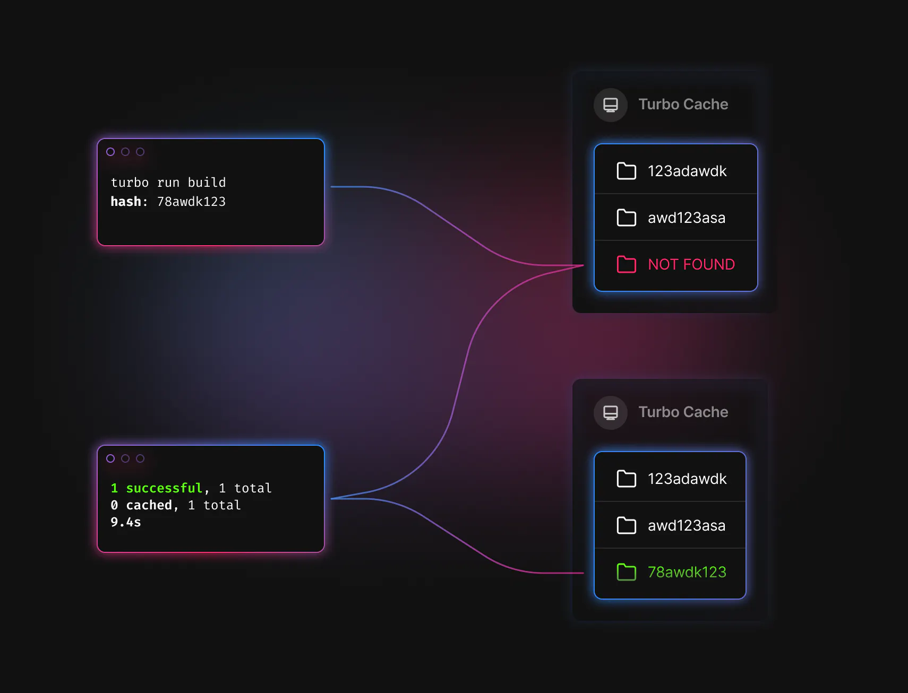
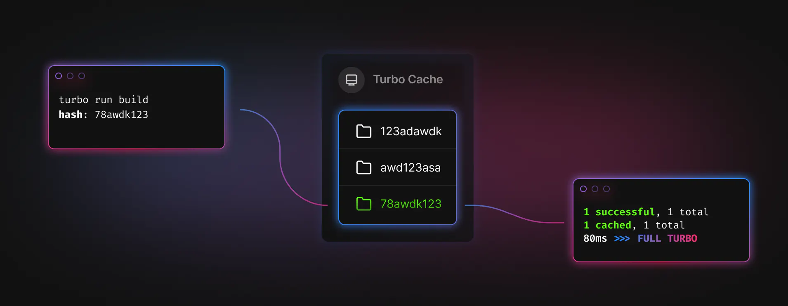

When I was working at e-commerce enabler startup, there are few quite days where I find myself frustrated with our polyrepo architecture. Most of our apps shared the same code and logic, in order to reduce the repetitiveness, we created an internal package/library a.k.a `shared-components` and publish it on npm registry.

## The Problem

It's all good untill bug started to appear on `shared-components`, causing an error on `app A` and `app B`. We'lll need to :

1. Make a new commit on `shared-components` to fix the error.
2. Run a publish task inside `shared-components` to publish it to npm.
3. Make a new commit on `app A`, bumping the version of the `shared-components` dependency
4. Make a new commit on `app B`, bumping the version of the `shared-components` dependency
5. Deploy `app A`
6. Deploy `app B`

Same thing goes with releasing a new feature on `shared-components`, bumping version of hell. The worst part of it, we have **6-8 applications**, meaning we had to repeat the bump version step 6-8 times. IMHO, it's not a good DX(developer experience).

## Solution

Fast forward, I resigned from the job (not because of our polyrepo issue obviously 😅) and along the way I found a tool that could solve the DX issue of my previous employer. It's called [Turborepo](https://turbo.build/repo/docs), a high-performance build system for JavaScript and TypeScript codebases. Before we dive deep into Turborepo, I would like to discuss more about monorepo.

### What is Monorepo ?

Monorepo is a single repository containing multiple projects in a single codebase. While these projects may be related, they are often logically independent and sometimes run by diferrent teams.

### Monorepo Pros

- Simpler dependency management
- Consistency
- Unified CI/CD
- Unified build process

With these benefits, refering to our issue earlier, in a monorepo setup `shared-components` would be in the same codebase as `app A` and `app B`. Tackling a bug would be so much easier :

1. Make a new commit on `shared-components` to fix the error.
2. Deploy `app A` and `app B`

No versioning is required, because `app A` and `app B` don't depend on the version of `shared-components` in `npm` - they depend on the version that's in the codebase.

### Monorepo Cons

As our codebase grow, monorepo is difficult to scale up. The `CI` process may take longer than usual. Even though there is only one changes in `app A`, we had to run the entire projects task. Bummer. Worry not, that is where Turborepo came in to play.

## Turborepo Caching

Turborepo solves our monorepo's scaling problem by storing the result of all our tasks to remote cache stores, meaning that our `CI` never needs to do the same work twice. Let's say we want to run a `build` task with Turborepo using `turbo run build`:



1. Turborepo will evaluate the inputs to your task and turn them into a hash (e.g. `78awdk123`).
2. Check the local filesystem cache for a matching cache artifact (e.g.`./node_modules/.cache/turbo/78awdk123.tar.zst`).
3. If Turborepo doesn't find any matching artifacts for the calculated hash, Turborepo will then execute the task.
4. Once the task is completed, Turborepo **saves all specified outputs** (including files and logs) into a new cache artifact, addressed by the hash.

Let's say that you run the task again without changing any of its inputs:



1. The hash will be the same because the inputs haven't changed (e.g. `78awdk123`)
2. Turborepo will find the cache artifact with a matching hash (e.g. `./node_modules/.cache/turbo/78awdk123.tar.zst`)
3. Instead of running the task, Turborepo will replay the output - printing the saved logs to stdout and restoring the saved output files to their respective position in the filesystem.

Restoring files and logs from the cache happens near-instantaneously. This can reduce our build times from minutes or hours down to seconds or milliseconds.

## Getting Started

In this section, we will try to create a new monorepo based on [Turborepo's Getting Started docs](https://turbo.build/repo/docs/getting-started/create-new). Also worth to noting, this section is a summary of Turborepo's documentation rather than my own writing.

To create a new monorepo, use Turborepo's npm package `create-turbo`. In this case I'm using `pnpm` as my package manager.

```bash
pnpm dlx create-turbo@latest
```

You'll be asked a few questions

### Where would you like to create your turborepo?

You'll be able to choose anywhere you like. The default is `./my-turborepo`.

### Which package manager do you want to use?

Turborepo doesn't handle package installation. You'll be able to choose either :

- [npm](https://www.npmjs.com/)
- [yarn](https://yarnpkg.com/)
- [pnpm](https://pnpm.io/)

Once you've picked a package manager, `create-turbo` will create a bunch of new files inside the folder name you picked. It'll also install all the dependencies that come with the basic example by default.

```
>>> Creating a new turborepo with the following:
 - apps/web: Next.js with TypeScript
 - apps/docs: Next.js with TypeScript
 - packages/ui: Shared React component library
 - packages/eslint-config-custom: Shared configuration (ESLint)
 - packages/tsconfig: Shared TypeScript tsconfig.json
```

Each of these is a workspace - a folder containing a `package.json`. Each workspace can declare its own dependencies, run its own scripts, and export code for other workspaces to use.

### Understanding `packages/ui`

First, open `./packages/ui/package.json`. You'll notice that the package's name is "name": "ui" - right at the top of the file.

Next, open `./apps/web/package.json`. You'll notice that this package's name is "name": "web". But also - take a look in its dependencies.

You'll see that "web" depends on a package called "ui". If you're using pnpm, you'll see it's declared like this:

```json
{
  "dependencies": {
    "ui": "workspace:*"
  }
}
```

This means that our **web app depends on our local `ui` package**.

If you look inside `apps/docs/package.json`, you'll see the same thing. Both `web` and `docs` depend on `ui` - a shared component library.

This pattern of sharing code across applications is extremely common in monorepos - and means that multiple apps can share a single design system.

### Understanding imports and exports

Take a look inside `./apps/docs/pages/index.tsx`. Both docs and web are [Next.js](https://nextjs.org/) applications, and they both use the ui library in a similar way:

```tsx
import { Button } from "ui";
//      ^^^^^^        ^^

export default function Docs() {
  return (
    <div>
      <h1>Docs</h1>
      <Button />
    </div>
  );
}
```

They're importing `Button` directly from a dependency called `ui`! How does that work? Where is Button coming from?

Open `packages/ui/package.json`. You'll notice these two attributes:

```json
{
  "main": "./index.tsx",
  "types": "./index.tsx"
}
```

When workspaces import from `ui`, `main` tells them where to access the code they're importing. `types` tells them where the TypeScript types are located.

So, let's look inside `packages/ui/index.tsx`:

```tsx
import * as React from "react";
export * from "./Button";
```

Everything inside this file will be able to be used by workspaces that depend on `ui`.

`index.tsx` is exporting everything from a file called `./Button`, so let's go there:

```tsx
import * as React from "react";

export const Button = () => {
  return <button>Boop</button>;
};
```

We've found our button! Any changes we make in this file will be shared across `web` and `docs`. Pretty cool!

### Building with Turborepo

Let's try running our build script:

```bash
pnpm build
```

Only `apps/docs` and `apps/web` specify a build script in their package.json, so only those are run.

Take a look inside `build` in `turbo.json`. There's some interesting config there.

```json
{
  "pipeline": {
    "build": {
      "outputs": [".next/**", "!.next/cache/**"]
    }
  }
}
```

You'll notice that some `outputs` have been specified. Declaring outputs will mean that when `turbo` finishes running your task, it'll save the output you specify in its cache.

Both `apps/docs` and `apps/web` are Next.js apps, and they output builds to the `./.next` folder.

Let's try something. Delete the `apps/docs/.next` build folder.

Run the `build` script again. You'll notice:

We hit `FULL TURBO` - the builds complete in under 100ms.
The `.next` folder re-appears!
Turborepo cached the result of our previous build. When we ran the `build` command again, it restored the entire `.next/**` folder from the cache. To learn more, check out Turborepo's docs on [cache outputs](https://turbo.build/repo/docs/core-concepts/caching/what-to-cache).

### Running dev script

Let's now try running `dev`.

```bash
pnpm dev
```

You'll notice some information in the terminal:

1. Only two scripts will execute - `docs:dev` and `web:dev`. These are the only two workspaces which specify `dev`.
2. Both `dev` scripts are run simultaneously, starting your Next.js apps on ports `3000` and `3001`.
3. In the terminal, you'll see `cache bypass, force executing`.

Try quitting out of the script, and re-running it. You'll notice we don't go `FULL TURBO`. Why is that?

Take a look at turbo.json:

```json
{
  "pipeline": {
    "dev": {
      "cache": false,
      "persistent": true
    }
  }
}
```

Inside `dev`, we've specified `"cache": false`. This means we're telling Turborepo not to cache the results of the `dev` script. `dev` runs a persistent dev server and produces no outputs, so there is nothing to cache. Learn more about it in Turborepo's docs on [turning off caching](https://turbo.build/repo/docs/core-concepts/caching#turn-off-caching).

Additionally, we set `"persistent": true`, to let turbo know that this is a long-running dev server, so that turbo can ensure that no other tasks depend on it. You can read more in the [docs for the persistent option](https://turbo.build/repo/docs/reference/configuration#persistent).

### Running `dev` on only one workspace at a time

By default, `turbo dev` will run `dev` on all workspaces at once. But sometimes, we might only want to choose one workspace.

To handle this, we can add a `--filter` flag to our command.

```bash
pnpm dev --filter docs
```

You'll notice that it now only runs docs:dev. Learn more about [filtering workspaces](https://turbo.build/repo/docs/core-concepts/monorepos/filtering) from Turborepo's docs.

## The End

Turborepo has helped me and my team to excel our productivity, not only preventing us from doing repetitive tasks, Turborepo has improve our `CI` time `3x faster`. Also worth noting, this blog post doesn't cover the entire usage of Turborepo, I encourage you to visit their [docs](https://turbo.build/repo/docs) for more advanced usage. Massive thanks to Vercel and Turbo team, that will be all for me. Thank you for reading my blog post!

Naofal signing out.
